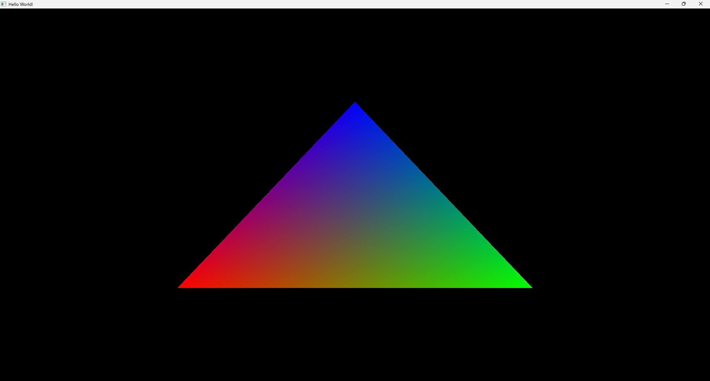

# Part 1 - Introduction
## Introduction
Genesis is a graphics library for Haxe that aims to be minimalistic and simple, yet powerful.  
In this guide, you will learn how to set up Genesis and draw a simple triangle on the screen.



## Prerequisites
This guide assumes that you have a basic understanding of Haxe and how to set up a Haxe project.    
It is also highly recommended that you read the "Concepts" section of the documentation to get a good understanding of the fundamentals.  
If you are completely new to graphics programming, you may want to try something like OpenGL first because of the vast amount of resources available.

## Installing Haxe
This guide assumes that you have Haxe installed on your system. If not, you can download it from the [official website](https://haxe.org/download/).
After installing Haxe, you will need to install the Haxe C++ target:
```sh
haxelib install hxcpp
```

## Setting Up
To get started, you will need to install Genesis, which can be done using Haxelib:
```sh
haxelib git genesis https://github.com/mikaib/genesis.git
```

After this you will need to setup a basic Haxe project.  

**Source/Main.hx:**
```hx
class Main {

    public static function main() {
        trace("Hello, World!");
    }
    
}
```

**Build.hxml:**
```hxml
# Source dir
-cp Source

# Include the Genesis library
-L genesis

# 64-bit is recommended but not required.
-D HXCPP_M64

# Main.hx class
-main Main

# Output using C++
--cpp Binary
```

## Conclusion
You now have a basic Haxe project setup with Genesis.  
In the next part you will learn how to create a window using SDL2.