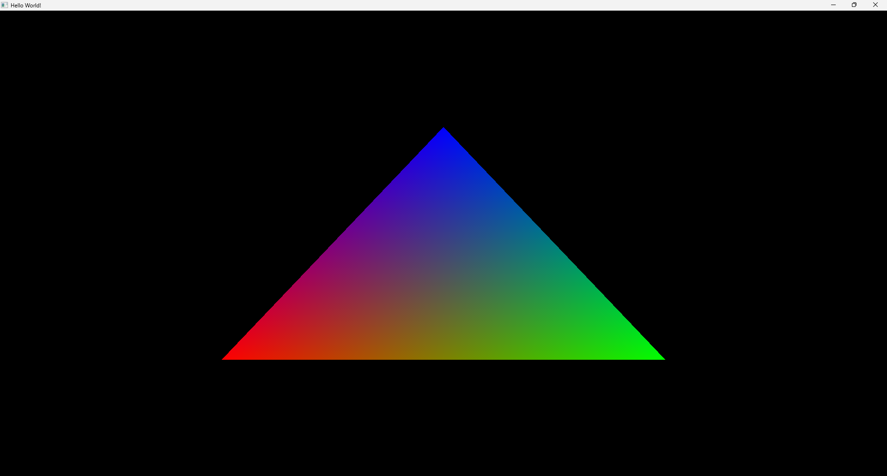

# genesis
A basic rendering library for Haxe.  



## Disclaimer
This library is still in development and is not yet ready for production use.  
Please be aware that the API may change and that there may be bugs.  

## Getting Started
Simply install the library (preferably using git) and add it to your Haxe project.  
You can look through the samples in the `samples` directory to get an idea of how to use the library.  
There is also a documentation directory containing detailed information about the library (but it is not kept up-to-date all the time, touché).
For the API documentation, please refer to [https://mki.sh/genesis-docs/genesis/Genesis.html](https://mki.sh/genesis-docs/genesis/Genesis.html).

## License
This library is licensed under the MIT license. If you have any questions regarding usage please ask me on Discord.

## Flags
- `GS_STUB` Generates stubs for the main `Genesis` class allowing you to see function calls in the profiler.  
   This is disabled by default as it is only needed for profiling using Tracy, it may also prove useful for using genesis with cppia.
- `GS_ANDROID_GLES2` Disables GLES3 and uses GLES2 on Android.  
   This is disabled by default as most devices *should* support GLES3.
- `GS_EMSCRIPTEN_GLES3` Enabled GLES3 support for emscripten.  
   This is disabled by default as it is experimental and may not work as expected.
- `GS_EMSCRIPTEN_GLFW` When using any GLFW externs, you may define this flag to force the usage of GLFW, if it isn't already defined.  
   This is disabled by default as it is only needed for emscripten.
- `GS_EMSCRIPTEN_SDL` When using any SDL externs, you may define this flag to force the usage of SDL, if it isn't already defined.  
   This is disabled by default as it is only needed for emscripten.
-  `GS_WAYLAND` Enables wayland support.  
   This flag or `GS_X11` is automatically selected based on your build environment, but you can override it if you want to force a specific backend.
- `GS_X11` Enables X11 support.  
   This flag or `GS_WAYLAND` is automatically selected based on your build environment, but you can override it if you want to force a specific backend.
- `GS_DISABLE_EVENTLOOP` Disables support for the haxe event loop, this is useful because the event loop allocates stuff on the heap every time it is progressed.

## Backends / Platforms
Currently, the platform only supports OpenGL on Windows. 
Linux should be fairly straightforward to add and web did also work at some point (but I broke it)

## Q&A
### Why is this library called Genesis?
Genesis is another word for "origin", it is what powers my game framework.

### Why use this over other libraries?
Probably don't, this library is designed to give a modern low-level API for graphics programming in Haxe without special runtimes, build tools or configuration.  
It is *specifically* designed in a way that I enjoy using it (which may mean that there are some weird quirks in the library's usage)

### Are you planning to support HashLink?
Yes.

### What are you planning to support?
My first goal will be linux followed by android and web (Desktop will stay the main focus for now).  
After adding these platforms I'd like to look into DX11 and DX12/Vulkan. 

### Profiling using Tracy
This library is simply some bindings to a backend written in C. To profile it using tracy please add the following to your `build.hxml`:
```hxml
-D GS_STUB
```
This will create stubs for the main `Genesis` class allowing you to see function calls in the profiler.

## Special Thanks
-  MAJigsaw77 (Mihai Alexandru), fixed haxe's event loop. Thank you :D  

**Bottom of README, thank you for reading (/≧▽≦)/**
